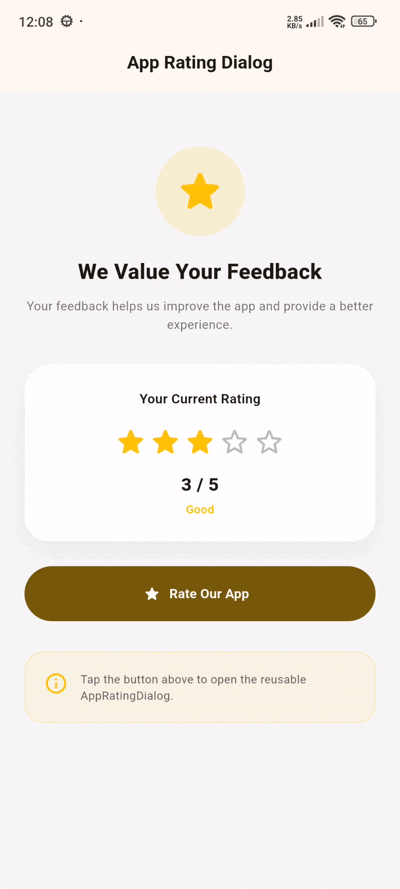

# flutter_app_rating

[](https://flutter.dev)
[](https://opensource.org/licenses/MIT)
[](#)

**flutter_app_rating** is a premium, lightweight, highly customizable, and interactive app rating dialog widget for Flutter. It features smooth animated star ratings, dynamic text labels based on score, custom color themes, and seamless asynchronous dialog result handling.

---

## 📷 Preview

<p align="center">
  
</p>

*A premium interactive app rating dialog featuring smooth star scale animations, live score descriptive labels, custom colors, and callback triggers.*

---

## ✨ Features

- **⭐ Interactive Star Rating**
  - Smooth animated star scaling and selection for up to 5 (or custom max) stars.
- **🏷️ Animated Rating Labels**
  - Dynamic descriptive text feedback (e.g., *Poor*, *Fair*, *Good*, *Very Good*, *Excellent*) that updates as the user selects stars.
- **🎨 High-Fidelity Custom Styling**
  - Easily customize active star color, inactive outline color, star size, dialog title, message body, and action button text.
- **⚡ Simple Async API**
  - Launch with `AppRatingDialog.show(context)` which returns a `Future<int?>` containing the selected rating integer (or `null` if cancelled).
- **🔔 Optional Callback Support**
  - Supports an `onRated` callback parameter for immediate event handling when a rating is submitted.
- **🛡️ Barrier Dismissible Control**
  - Option to allow or prevent dismissing the dialog by tapping outside the backdrop.

---

## 📦 Installation

To use this library in your Flutter project, add it to your `pubspec.yaml` dependencies:

```yaml
dependencies:
  flutter:
    sdk: flutter
  # From pub.dev
  flutter_app_rating: ^0.0.1
```

Or reference it directly from a Git repository:

```yaml
dependencies:
  flutter_app_rating:
    git:
      url: https://github.com/your_username/flutter_app_rating.git
      ref: main
```

---

## 🚀 Usage

Import the package in your Dart code:

```dart
import 'package:flutter_app_rating/flutter_app_rating.dart';
```

### 1. Simple Rating Dialog
Launch the rating dialog with default configuration and await the selected rating score.

```dart
final rating = await AppRatingDialog.show(
  context,
  title: 'Rate Our App',
  message: 'Your feedback helps us improve!',
);

if (rating != null) {
  print('User rated: $rating stars');
}
```

### 2. Rating Dialog with Callback & Custom Colors
Customize colors, star sizes, button text, and trigger an `onRated` callback immediately upon submission.

```dart
AppRatingDialog.show(
  context,
  title: 'Enjoying the App?',
  message: 'Please take a moment to rate your experience.',
  activeColor: Colors.amber,
  inactiveColor: Colors.grey.shade300,
  starSize: 42.0,
  cancelText: 'Maybe Later',
  submitText: 'Submit Rating',
  showRatingLabel: true,
  onRated: (rating) {
    print('Callback triggered with rating: $rating');
  },
);
```

### 3. Non-Dismissible Dialog with Custom Max Stars
Require the user to make a selection or tap cancel by disabling barrier dismissibility.

```dart
final rating = await AppRatingDialog.show(
  context,
  title: 'Rate This Feature',
  message: 'How would you rate this specific feature?',
  maxRating: 5,
  barrierDismissible: false,
);
```

---

## 🛠️ API Reference

### `AppRatingDialog.show()` parameters:

| Property | Type | Default | Description |
| :--- | :--- | :--- | :--- |
| `context` | `BuildContext` | *required* | Build context required to present the dialog. |
| `title` | `String` | `'Rate Our App'` | Header title displayed inside the rating dialog. |
| `message` | `String` | `'Your feedback helps us improve.'` | Subtitle message displayed in the dialog body. |
| `onRated` | `ValueChanged<int>?` | `null` | Callback function triggered when a user submits a rating score. |
| `activeColor` | `Color` | `Colors.amber` | Accent color for filled stars, active labels, and primary buttons. |
| `inactiveColor` | `Color` | `Colors.grey` | Color of outline for unselected stars. |
| `maxRating` | `int` | `5` | Maximum number of rating stars to display. |
| `starSize` | `double` | `38` | Size (width/height in pixels) of each star icon. |
| `cancelText` | `String` | `'Cancel'` | Text for the cancel action button. |
| `submitText` | `String` | `'Submit'` | Text for the submit action button. |
| `showRatingLabel` | `bool` | `true` | Whether to display dynamic text labels below stars (e.g., *Good*, *Excellent*). |
| `barrierDismissible` | `bool` | `true` | Whether tapping outside the dialog container dismisses it. |

---

## 📄 License

```lic
MIT License

Copyright (c) 2026 Excelsior Technologies

Permission is hereby granted, free of charge, to any person obtaining a copy
of this software and associated documentation files (the "Software"), to deal
in the Software without restriction, including without limitation the rights
to use, copy, modify, merge, publish, distribute, sublicense, and/or sell
copies of the Software, and to permit persons to whom the Software is
furnished to do so, subject to the following conditions:

The above copyright notice and this permission notice shall be included in all
copies or substantial portions of the Software.

THE SOFTWARE IS PROVIDED "AS IS", WITHOUT WARRANTY OF ANY KIND, EXPRESS OR
IMPLIED, INCLUDING BUT NOT LIMITED TO THE WARRANTIES OF MERCHANTABILITY,
FITNESS FOR A PARTICULAR PURPOSE AND NONINFRINGEMENT. IN NO EVENT SHALL THE
AUTHORS OR COPYRIGHT HOLDERS BE LIABLE FOR ANY CLAIM, DAMAGES OR OTHER
LIABILITY, WHETHER IN AN ACTION OF CONTRACT, TORT OR OTHERWISE, ARISING FROM,
OUT OF OR IN CONNECTION WITH THE SOFTWARE OR THE USE OR OTHER DEALINGS IN THE
SOFTWARE.
```
